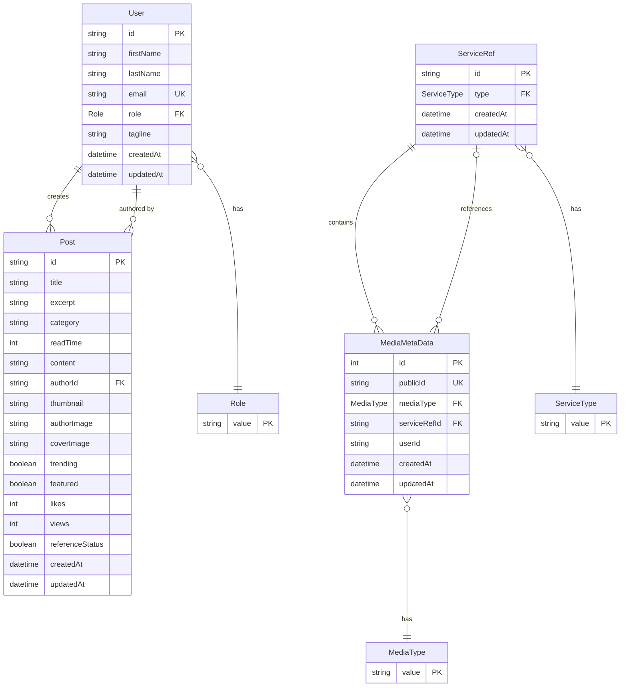

**Enums:**
```
Role:
├── OWNER         (Supreme power)
├── MODERATOR     (Can appoint/demote Admins, manage space)
├── ADMIN         (Reviews posts, cannot demote Admins)
├── COLLABORATOR  (Default contributor/member)
└── USER          (Regular user with limited permissions)

MediaType:
├── IMAGE
└── VIDEO

ServiceType:
├── POST
└── PROFILE
```
