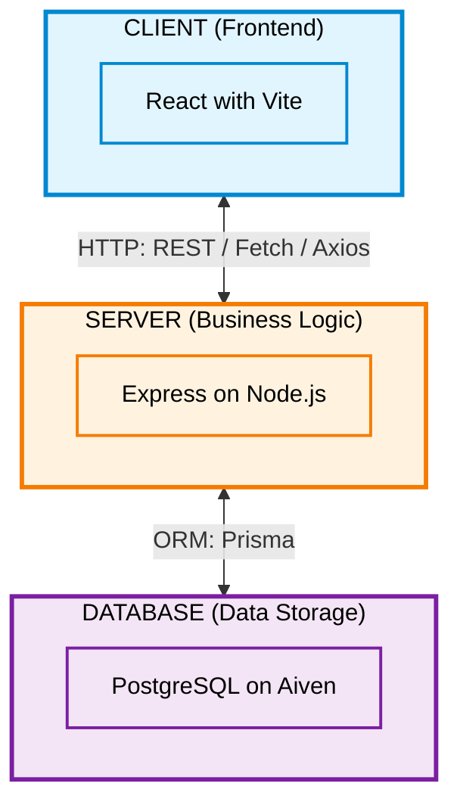

```mermaid

flowchart TD
    subgraph Client["CLIENT (Frontend)"]
        A[React with Vite]
    end
    
    subgraph Server["SERVER (Business Logic)"]
        B[Express on Node.js]
    end
    
    subgraph Database["DATABASE (Data Storage)"]
        C[PostgreSQL on Aiven]
    end
    
    Client <-->|HTTP: REST / Fetch / Axios| Server
    Server <-->|ORM: Prisma| Database
    
    style Client fill:#e1f5ff,stroke:#0288d1,stroke-width:3px,color:#000
    style Server fill:#fff3e0,stroke:#f57c00,stroke-width:3px,color:#000
    style Database fill:#f3e5f5,stroke:#7b1fa2,stroke-width:3px,color:#000
    style A fill:#e1f5ff,stroke:#0288d1,stroke-width:2px,color:#000
    style B fill:#fff3e0,stroke:#f57c00,stroke-width:2px,color:#000
    style C fill:#f3e5f5,stroke:#7b1fa2,stroke-width:2px,color:#000
```
