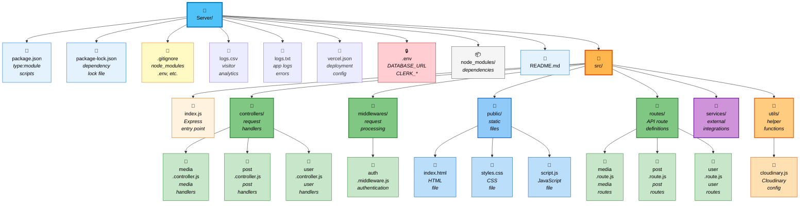

## Current Server Structure (as of 5 October 2025 )-
**NOT UPDATED !**

```mermaid
graph TB
    Root["📁<br/>Server/"]
    
    Root --> PKG["📄<br/>package.json<br/><i>type:module<br/>scripts</i>"]
    Root --> LOCK["📄<br/>package-lock.json<br/><i>dependency<br/>lock file</i>"]
    Root --> GIT["📄<br/>.gitignore<br/><i>node_modules<br/>.env, etc.</i>"]
    Root --> LOGCSV["📄<br/>logs.csv<br/><i>visitor<br/>analytics</i>"]
    Root --> LOGTXT["📄<br/>logs.txt<br/><i>app logs<br/>errors</i>"]
    Root --> VERCEL["📄<br/>vercel.json<br/><i>deployment<br/>config</i>"]
    Root --> ENV["🔒<br/>.env<br/><i>DATABASE_URL<br/>CLERK_*</i>"]
    Root --> NM["📦<br/>node_modules/<br/><i>dependencies</i>"]
    Root --> README["📄<br/>README.md"]
    Root --> SRC["📁<br/>src/"]
    
    SRC --> INDEX["📄<br/>index.js<br/><i>Express<br/>entry point</i>"]
    SRC --> CTRL["📁<br/>controllers/<br/><i>request<br/>handlers</i>"]
    SRC --> MIDW["📁<br/>middlewares/<br/><i>request<br/>processing</i>"]
    SRC --> PUB["📁<br/>public/<br/><i>static<br/>files</i>"]
    SRC --> ROUTES["📁<br/>routes/<br/><i>API route<br/>definitions</i>"]
    SRC --> SERV["📁<br/>services/<br/><i>external<br/>integrations</i>"]
    SRC --> UTILS["📁<br/>utils/<br/><i>helper<br/>functions</i>"]
    
    CTRL --> CTRLM["📄<br/>media<br/>.controller.js<br/><i>media<br/>handlers</i>"]
    CTRL --> CTRLP["📄<br/>post<br/>.controller.js<br/><i>post<br/>handlers</i>"]
    CTRL --> CTRLU["📄<br/>user<br/>.controller.js<br/><i>user<br/>handlers</i>"]
    
    MIDW --> AUTH["📄<br/>auth<br/>.middleware.js<br/><i>authentication</i>"]
    
    PUB --> HTML["📄<br/>index.html<br/><i>HTML<br/>file</i>"]
    PUB --> CSS["📄<br/>styles.css<br/><i>CSS<br/>file</i>"]
    PUB --> JS["📄<br/>script.js<br/><i>JavaScript<br/>file</i>"]
    
    ROUTES --> ROUTEM["📄<br/>media<br/>.route.js<br/><i>media<br/>routes</i>"]
    ROUTES --> ROUTEP["📄<br/>post<br/>.route.js<br/><i>post<br/>routes</i>"]
    ROUTES --> ROUTEU["📄<br/>user<br/>.route.js<br/><i>user<br/>routes</i>"]
    
    UTILS --> CLOUD["📄<br/>cloudinary.js<br/><i>Cloudinary<br/>config</i>"]
    
    style Root fill:#4fc3f7,stroke:#0277bd,stroke-width:3px,color:#000
    style SRC fill:#ffb74d,stroke:#e65100,stroke-width:3px,color:#000
    style CTRL fill:#81c784,stroke:#2e7d32,stroke-width:2px,color:#000
    style MIDW fill:#81c784,stroke:#2e7d32,stroke-width:2px,color:#000
    style PUB fill:#90caf9,stroke:#1565c0,stroke-width:2px,color:#000
    style ROUTES fill:#81c784,stroke:#2e7d32,stroke-width:2px,color:#000
    style SERV fill:#ce93d8,stroke:#6a1b9a,stroke-width:2px,color:#000
    style UTILS fill:#ffcc80,stroke:#e65100,stroke-width:2px,color:#000
    
    style PKG fill:#e3f2fd,stroke:#1976d2,stroke-width:1px,color:#000
    style LOCK fill:#e3f2fd,stroke:#1976d2,stroke-width:1px,color:#000
    style GIT fill:#fff9c4,stroke:#f57f17,stroke-width:1px,color:#000
    style ENV fill:#ffcdd2,stroke:#c62828,stroke-width:1px,color:#000
    style NM fill:#f5f5f5,stroke:#616161,stroke-width:1px,color:#000
    style README fill:#e3f2fd,stroke:#1976d2,stroke-width:1px,color:#000
    style INDEX fill:#fff3e0,stroke:#ef6c00,stroke-width:1px,color:#000
    style CTRLM fill:#c8e6c9,stroke:#388e3c,stroke-width:1px,color:#000
    style CTRLP fill:#c8e6c9,stroke:#388e3c,stroke-width:1px,color:#000
    style CTRLU fill:#c8e6c9,stroke:#388e3c,stroke-width:1px,color:#000
    style AUTH fill:#c8e6c9,stroke:#388e3c,stroke-width:1px,color:#000
    style HTML fill:#bbdefb,stroke:#1565c0,stroke-width:1px,color:#000
    style CSS fill:#bbdefb,stroke:#1565c0,stroke-width:1px,color:#000
    style JS fill:#bbdefb,stroke:#1565c0,stroke-width:1px,color:#000
    style ROUTEM fill:#c8e6c9,stroke:#388e3c,stroke-width:1px,color:#000
    style ROUTEP fill:#c8e6c9,stroke:#388e3c,stroke-width:1px,color:#000
    style ROUTEU fill:#c8e6c9,stroke:#388e3c,stroke-width:1px,color:#000
    style CLOUD fill:#ffe0b2,stroke:#e65100,stroke-width:1px,color:#000
```
