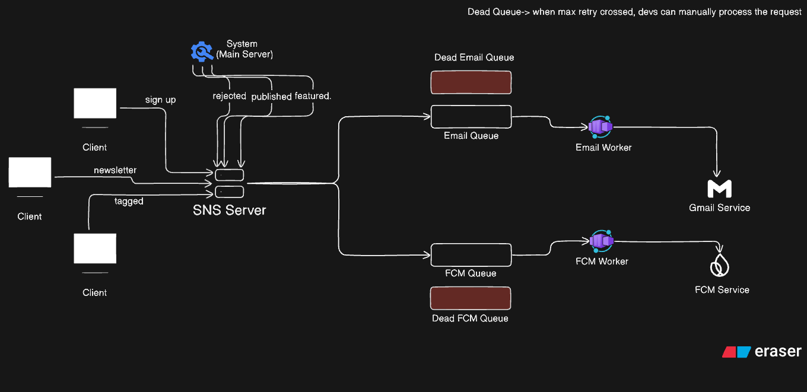

# Kenshi-Webspace-Notif-Microservice
Microservice for Kenshi Webspace to handle push notifs, emails and other smtp communications.

## System Design-
   
## Plan-

```
root/
│
├── src/
│   ├── app.js                 # Express app bootstrap
│   ├── server.js              # HTTP server start
│   │
│   ├── config/
│   │   ├── index.js            # Env loader
│   │   ├── db.js               # DB connection (if needed)
│   │   ├── queue.js            # Queue config (future-ready)
│   │
│   ├── routes/
│   │   └── notify.routes.js    # /notify endpoint
│   │
│   ├── controllers/
│   │   └── notify.controller.js
│   │
│   ├── services/
│   │   ├── notification.service.js   # Core orchestration
│   │   ├── event-router.service.js   # Maps events → actions
│   │
│   ├── providers/
│   │   ├── email.provider.js
│   │   ├── inapp.provider.js
│   │   ├── push.provider.js           # future
│   │   └── sms.provider.js            # future
│   │
│   ├── templates/
│   │   ├── email/
│   │   │   └── user-registered.hbs
│   │   └── inapp/
│   │       └── user-registered.json
│   │
│   ├── events/
│   │   ├── USER_REGISTERED.v1.js
│   │   └── PASSWORD_RESET.v1.js
│   │
│   ├── validators/
│   │   └── notify.validator.js
│   │
│   ├── jobs/
│   │   └── retry-failed.job.js         # cron / workers
│   │
│   ├── utils/
│   │   ├── logger.js
│   │   ├── constants.js
│   │   └── errors.js
│   │
│   └── middlewares/
│       ├── auth.middleware.js          # service-to-service auth
│       └── error.middleware.js
│
├── tests/
│   ├── unit/
│   └── integration/
│
├── .env.example
├── .gitignore
├── package.json
├── README.md
└── docker-compose.yml (optional)

```
